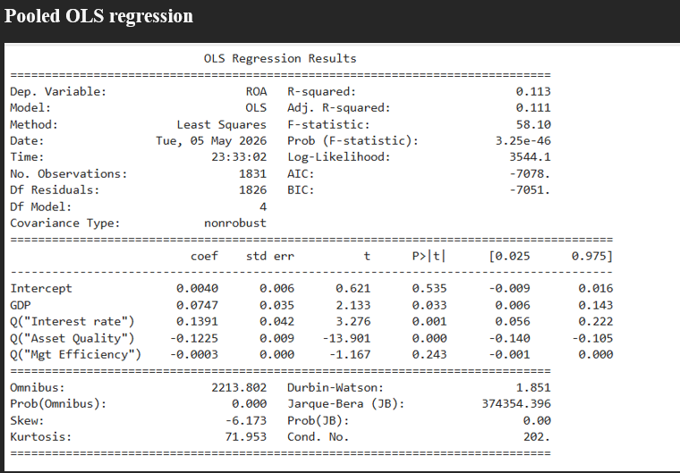
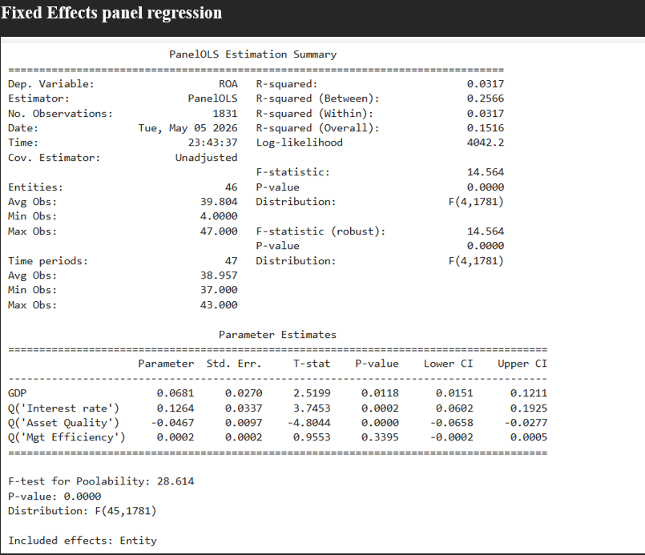
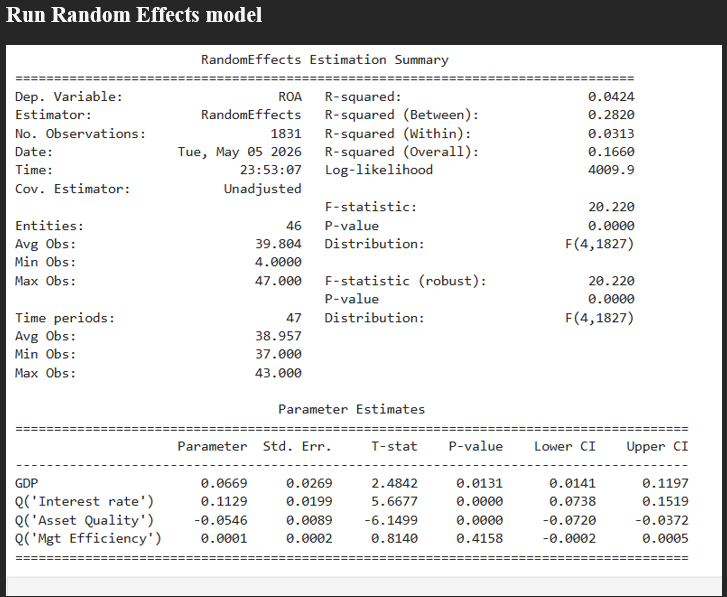

# 📊 Financial Performance Analytics for Kenyan Commercial Banks

A comprehensive panel data econometric analysis examining how macroeconomic variables influence the financial performance of Kenyan commercial banks between 2014 and 2024.

# 📖 Project Overview

Commercial banks operate in a constantly changing economic environment where fluctuations in GDP growth, inflation, and interest rates directly affect profitability. Understanding these relationships enables financial institutions to make informed lending decisions, manage risk effectively, and improve long-term financial performance.

This project investigates the impact of GDP Growth, Interest Rates, and Inflation on the Return on Assets (ROA) of Kenyan commercial banks. Asset Quality and Management Efficiency were included as control variables to provide a more comprehensive analysis.

Using quarterly data collected from 46 Kenyan commercial banks over eleven years (2014–2024), this project demonstrates an end-to-end data analytics workflow using Python, from data preparation and exploratory analysis to panel regression modelling and business insight generation.

# 🎯 Business Problem

Commercial banks face changing macroeconomic conditions that influence lending, borrowing, investment, and profitability. While internal operations can be managed, economic variables such as GDP growth, inflation, and interest rates remain external forces that significantly shape financial performance.

# Research Question

**How do macroeconomic variables influence the financial performance of Kenyan commercial banks?**

# 📂 Dataset
Country: Kenya
Industry: Commercial Banking
Study Period: 2014 – 2024 
Frequency: Quarterly 
Banks: 46 Commercial Banks 
Dependent Variable: Return on Assets (ROA) 
Independent Variables: GDP Growth, Interest Rate, Inflation 
Control Variables: Asset Quality, Management Efficiency 

# 🛠 Technologies Used

- Python
- Pandas
- NumPy
- Statsmodels
- Linearmodels
- Matplotlib
- OpenPyXL
- Jupyter Notebook
- Microsoft Excel

# 📈 Methodology

The project followed a structured analytical workflow:

- Data Collection
- Data Cleaning
- Data Transformation
- Exploratory Data Analysis (EDA)
- Correlation Analysis
- Multicollinearity Testing (VIF)
- Panel Regression Analysis
- Pooled Ordinary Least Squares (OLS)
- Fixed Effects Model
- Random Effects Model
- Diagnostic Testing
- Robust Standard Errors

# 📊 Key Findings

- GDP growth has a **positive and statistically significant** effect on bank profitability.
- Interest rates positively influence Return on Assets (ROA).
- Asset quality has a **negative and statistically significant** effect on profitability.
- Management efficiency was **not statistically significant** in explaining ROA.
- Macroeconomic conditions and effective credit risk management are key drivers of financial performance.

# 📸 Project Visualizations

## Descriptive Analysis

## Pooled OLS Regression Results

## Fixed Effects Panel Regression

## Random Effects Model

# 💼 Business Implications

The findings demonstrate that macroeconomic conditions play an important role in determining bank profitability. Strong economic growth and favourable interest rate environments support improved financial performance, while poor asset quality significantly reduces profitability.

The analysis provides valuable insights for:

- Financial Institutions
- Investors
- Risk Managers
- Policymakers
- Banking Regulators
- Financial Analysts

# 🚀 Future Improvements

- Develop an interactive Power BI dashboard.
- Forecast bank profitability using Machine Learning models.
- Incorporate additional macroeconomic indicators such as exchange rates and unemployment.
- Build an automated financial performance monitoring dashboard.

# 📁 Repository Structure

kenyan-commercial-banks-analysis/

│
├── data/
├── notebooks/
├── reports/
├── images/
├── README.md
├── LICENSE
└── requirements.txt

# 👩‍💻 Author

**Winnie Odhiambo**

Master's Candidate in Data Analytics | BBIT Graduate

Passionate about Data Analytics, Business Intelligence, Econometrics, Financial Analytics, and Machine Learning.

### If this project is interesting, consider giving the repository a star.
